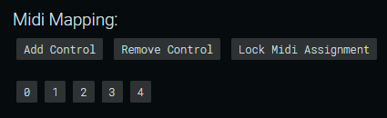

# a l e p h 

Aleph is a cross-platform, open source framework for developing and performing audio reactive visualizations. It is a desktop client built on [Electron](https://electronjs.org/) that uses [P5.js](https://p5js.org/) for graphics and audio analysis. Aleph exposes all of p5’s 2D *and* 3D functionality inside every user created sketch with some friendly wrappers for common boring things thrown in for good measure. In addition, Aleph provides MIDI control support which is sadly not offered by vanilla p5. Think of it as an enhanced environment for developing and performing audio-reactive p5 sketches.

## The Interface:
When you first launch Aleph, you will see the editor window, which looks like this:


#### Display Settings:
Aleph displays your actual p5 sketches on a separate window with no UI elements (called the display window) so you can present fullscreen graphics on a secondary display while still being able to access the editor window. You can manually assign a screen resolution by entering values into the Width and Height inputs and create the display using the “Create Display” button. This is useful if you need an exact size for whatever reason. You can also specify pixel density and enable/disable anti-aliasing for images/textures. Alternatively, because Aleph supports dynamically resizable windows, you can simply click “Create Display” without providing a size, and manually resize (or maximize) the window as you see fit. Once you have spawned a display you can enter fullscreen mode by pressing F11 or CTRL+SHIFT+F. 

###### *Note: many controls on the Aleph control panel are disabled until the display window is created. You cannot adjust audio settings, select sketches, or configure MIDI devices until the display window has been created.*

#### Audio Settings:
* *Volume*: Adjusts volume input sensitivity.
* *Bass*: Adjusts bass frequency input sensitivity.
* *Mid*: Adjusts mid frequency input sensitivity.
* *High*: Adjusts high frequency input sensitivity.
* *FFT Smooth*: Adjusts FFT smoothing. High smoothing values result in more gradual changes between frames. 
* *Volume Smooth*: Adjusts volume smoothing. High smoothing values result in more gradual changes between frames.

#### Import Assets:
Use the labeled buttons to import custom 3D models, textures, fonts, and shaders to use in your sketches. Files will be imported to the folder `resources/app/aleph_modules/core/assets`.

#### Available Assets:
Use the “show/hide” button to toggle visibility of all assets available to your local installation of Aleph. The files are displayed exactly as they should be correctly referenced in your code - ex. An imported 3D model called “myModel.obj” would be referenced as `assets.models.myModel`, as it is listed in the UI.

#### Sketch Selection:
On boot, Aleph will automatically scan your sketches folder (located at `resources/app/aleph_modules/core/sketches`) and generate labeled buttons for each sketch. You can toggle the active sketch by clicking the corresponding button of the sketch you would like to switch to. In a future update, switching sketches will also be possible via MIDI control.

#### Midi Device Selection:
On boot, Aleph will automatically scan your computer for available MIDI devices and generate labeled buttons for each device. To select a device, simply click its button. This will enable you to use the device to send MIDI controls to Aleph. 

###### *Note: at present, there is no ability to change MIDI devices or assign multiple MIDI devices. Attempting to change MIDI device after selecting one will likely result in a crash or error with MIDI handling. If you need to reselect a MIDI device, refresh Aleph by pressing CTRL+R (or CMD+R on Mac) and reselect a device. Improvements in this department are on the roadmap!*

#### Midi Mapping:
Once you have selected a MIDI input device, you can begin mapping controls. This is 
done by first creating a control entry by clicking “Add Control”.

Next you can create an assignment by clicking the numbered box created below to “listen” for MIDI messages, then pressing/turning a MIDI control on your controller to assign that physical control to the corresponding entry.

Once you have mapped all your controls, you can click “Lock Midi Assignment” to disable the assignment buttons. This prevents you from accidentally overwriting control entries. You can also save/recall mapping files.

## Using Aleph

#### Getting Audio Into Aleph:
**If you only need to receive audio on the computer running Aleph** (i.e. the audio is being generated on another device), you simply need to make sure the input on your soundcard receiving the audio input is selected as the primary input in the OS's sound configuration settings.

**If you need to send and receive audio on the same computer**, you will need to configure a loopback. There are two basic approaches to routing loopbacks into Aleph - physically routing a cable from the output of your soundcard to it's input, or using some software like [JACK](http://jackaudio.org/).

#### Adjusting Audio Parameters
A common problem with audio-reactive visualizations is that every song has different sonic characteristics. Many songs are mastered at different levels, making it hard to reliably link a visual parameter to some threshold of volume, for example. To address this, Aleph has some basic audio controls that you can use to adjust the audio signal inside Aleph (i.e. this will have no effect on the audible sound source). You can adjust the overall volume, the volume of different frequency bands, and adjust the smoothing of both the volume and the FFT. At present these must be controlled with the mouse, but MIDI control over these parameters are planned for a future update.

#### Using MIDI To Control Sketches
One of the most powerful features that Aleph brings to the table over vanilla p5 is it's ability to receive MIDI control input. You can use physical MIDI controllers or even send MIDI to Aleph from another program like Ableton Live, Max, or pd. See the "MIDI" section under "Writing Code" below for more detail on creating MIDI mappings. 

## Writing Code

#### A Note on P5:
Writing sketches for Aleph is nearly identical to writing vanilla p5 sketches. The primary difference is that a number of p5 related things are handled for you by Aleph, like audio analysis and dealing with files & windows. So if you ever encounter issues with your sketches or are looking for learning resources - look to the [p5.js community](https://p5js.org/community/) and their growing library of [documentation](https://p5js.org/reference/) and [examples](https://p5js.org/examples/)!

#### Folder Structure:
Aleph’s folders are structured like this:

```
├───assets
│   ├───fonts
│   ├───icons
│   │   ├───mac
│   │   ├───png
│   │   └───win
│   ├───models
│   ├───shaders
│   └───textures
├───core
│   ├───css
│   ├───html
│   └───js
├───docs
├───mappings
├───scripts
└───sketches
```

#### Creating Sketches:
You can add new sketches by clicking one of the create sketch buttons under the “Sketch Selection” header, which come in 2D and 3D flavors.

Follow the save dialog and assign your sketch a name. This will create a copy of the Aleph p5 module template which looks like this:

##### 2D Template
```javascript
exports.run = (audio, midi, assets, utils) => {
	// your code here
}
```

or this, if you're using the 3D option:

##### 3D Template
```javascript
let hasRun = {state: false};
let _3D;

exports.run = (audio, midi, assets, utils) => {
	utils.renderLoop(hasRun, setup, _3D, draw);
}

function setup(){
	let sketch = utils.getSketchName(__filename);
	_3D = renderers[sketch];
	// put code you only want to run once here
}

function draw(){
	// your code here
}
```

###### *Note that the `setup()` and `draw()` functions above are not actually native p5 functions, though they behave almost identically. `setup()` will execute whatever code is inside of it one time, while any code placed in the `draw()` function will run once per frame indefinitely. This is a hacky workaround to enable Aleph's mixed 2D/3D rendering capabilities while retaining a recognizable coding style from vanilla p5.*

The arguments passed into the run function `(audio, midi, assets, utils)` will allow you to access Aleph’s built in objects. You can manually create .js files in the directory `resources/app/aleph_modules/sketches`, but unless you copy in the above template, you will likely encounter issues.

#### Mixed 2D/3D Rendering:
Aleph uses p5's default 2D renderer as it's primary renderer to display the final image, but it creates a fresh 3D graphics buffer (renderer) for each sketch, allowing you to draw into an offscreen 3D buffer which gets drawn back into the main 2D renderer. The reason for this is that p5's 2D renderer has functionality that (at present) has not been implemented in their 3D (webgl based) renderer. This way you get the best of both worlds - want to draw stuff in 3D but then apply p5's `copy()` function (for example), which only works in 2D? You can do that. Aleph also generates a spare offscreen 2D buffer for if you want to do things like paint an entire 2D canvas across a 3D model as a texture, for example. This spare 2D renderer is accessed by calling `_2D.` before any standard p5 function like `_2D.line()`, `_2D.fill()`, `_2D.background()`, etc. Check out the `mixed2D_3D.js` example sketch to see that in action. If the concept of offscreen buffers is making you scratch your head, [check this example out](https://p5js.org/examples/structure-create-graphics.html).

### Built-in Objects:

#### Audio:
Aleph’s built-in `audio` object contains the following read-only properties:

*  *volume*: returns a value between 0.0 and 1.0 representing the current amplitude of the input signal.

*  *bass*: returns a value between 0.0 and 255 representing the amount of energy between 20-150Hz.

*  *mid*: returns a value between 0.0 and 255 representing the amount of energy between 400-2600Hz.

*  *high*: returns a value between 0.0 and 255 representing the amount of energy between 5200-14000Hz.

*  *leftVol*: returns a value between 0.0 and 1.0 representing the amplitude of the left audio channel.

*  *rightVol*: returns a value between 0.0 and 1.0 representing the amplitude of the left audio channel.

*  *volEased*: returns a smoothed value between 0.0 and 1.0 representing the amplitude of the master audio channel. Adjust the smoothing factor using the “vol. smooth” knob on the GUI.

*  *leftVolEased*: returns a smoothed value between 0.0 and 1.0 representing the amplitude of the left audio channel. Adjust the smoothing factor using the “vol. smooth” knob on the GUI.

*  *rightVolEased*: returns a smoothed value between 0.0 and 1.0 representing the amplitude of the right audio channel. Adjust the smoothing factor using the “vol. smooth” knob on the GUI.

*  *fft*: FFT analyzes a very short snapshot of sound called a sample buffer. It returns an array of amplitude measurements, referred to as bins. The array is 1024 bins long by default. You can change the bin array length, but it must be a power of 2 between 16 and 1024 in order for the FFT algorithm to function correctly. The actual size of the FFT buffer is twice the number of bins, so given a standard sample rate, the buffer is 2048/44100 seconds long.

*  *spectrum*: returns an array of amplitude values (between 0 and 255) across the frequency spectrum. Length is equal to FFT bins (1024 by default). The array indices correspond to frequencies (i.e. pitches), from the lowest to the highest that humans can hear. Each value represents amplitude at that slice of the frequency spectrum.

*  *waveform*: returns an array of amplitude measurements (between -1 and +1) that represent a snapshot of amplitude readings in a single buffer. Length will be equal to bins (defaults to 1024). Can be used to draw the waveform of a sound.

*  *spectralCentroid*: returns the spectral centroid of the input signal. The spectral centroid indicates where the "center of mass" of the spectrum is located. Perceptually, it has a connection with the impression of "brightness" of a sound.

#### Assets:
Aleph generates an object called `assets` by scanning your local assets folder. This object contains:

*  *models*: 3D models you can import, manipulate, and display in your sketches. Currently p5 only supports models in the .obj format.

*  *textures*: textures are 2D image files you can wrap around 3D models. gif, jpg, and png files are supported. you can also use them with any of p5's image related functions like `image()` or `loadPixels()`. 

*  *fonts*: load custom .otf or .ttf fonts to use in your sketches.

*  *shaders*: load custom glsl shaders to use in your sketches. 

You can access them in your p5 sketches like this: `assets.models.nameOfModel` where "nameOfModel" is the filename stripped of its extension. Ex. to access an imported 3D model called “car.obj”, you would use `assets.models.car`.

#### Midi:
Through the MIDI mapping process, Aleph will generate an array called `midi` which contains objects representing each assigned MIDI control, each with the index, note, and current CC value of a MIDI control. “Index” in this case refers to the number on the button (in Aleph’s interface) that corresponds with a given control.

  
Here we have 8 MIDI entries with indexes 0-7

You can access MIDI values in your p5 sketches like this: `midi[x].value` where `x` is the index of the control. Note that all MIDI controls output values between 0-127, so you might have to remap the values to different ranges depending on what you’re trying to accomplish. This can be accomplished easily using p5’s `map()` function.

#### Debugging:
Aleph includes Chrome DevTools which you can use to log things out to the console, examine HTML/CSS, capture performance statistics, and more. You can access the DevTools by pressing F12 on any platform, or the following OS specific hotkeys:

**Windows/Linux**: CTRL + SHIFT + I  
**MacOS**: CMD + ALT + I

###### *Note: each Aleph window contains its own separate instance of DevTools (including the UI window). If you wish to debug your p5 sketches, open DevTools on the window displaying your sketches.*

## Resources:
[Aleph Github](https://github.com/agohorel/aleph)  
[P5 docs](https://p5js.org/reference/)  
[Electron docs](https://electronjs.org/docs)  
[Node.js docs](https://nodejs.org/en/docs/)  
[Chromium docs](https://www.chromium.org/developers)

## Submitting Feedback
Please submit bugs to the [Aleph Github issue tracker](https://github.com/agohorel/aleph/issues).
You can also submit bug reports, feature requests, and/or general feedback to the [Aleph Discord server](https://discordapp.com/invite/c8fUQUb). Good [bug reporting etiquette](https://developer.mozilla.org/en-US/docs/Mozilla/QA/Bug_writing_guidelines) is greatly appreciated!