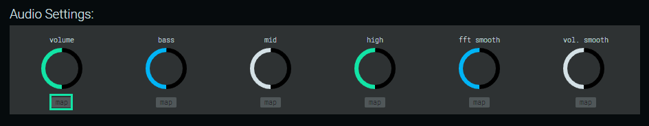
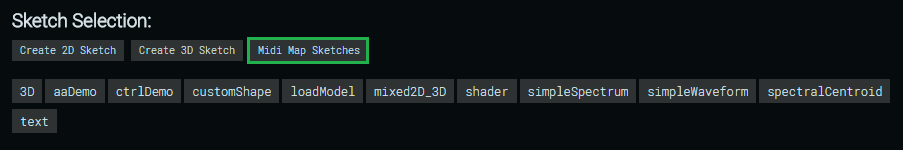
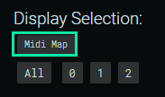
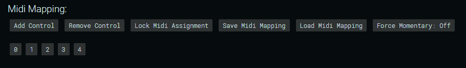

# a l e p h 

Aleph is a cross-platform desktop client and programming framework for developing and performing audio reactive visualizations. It is built on [Electron](https://electronjs.org/) and uses [P5.js](https://p5js.org/) for graphics and audio analysis. Aleph handles most of the behind-the-scenes work so you can get straight to writing code and getting things up on the screen, and it also adds MIDI support which is not featured in vanilla p5. Think of it as an enhanced environment for developing and performing audio-reactive p5 sketches.

## The Interface:

When you first launch Aleph, you will see the editor window, which looks like this:


#### Display Settings:

Aleph displays your p5 sketches on a separate window with no UI elements (called the display window) so you can present fullscreen graphics on a secondary display while still being able to access the editor window. You can manually assign a screen resolution by entering values into the Width and Height inputs and create the display using the “Create Display” button. This is useful if you need an exact size for whatever reason. You can also specify pixel density and enable/disable anti-aliasing for images/textures. Alternatively, because Aleph supports dynamically resizable windows, you can simply click “Create Display” without providing a size, and manually resize (or maximize) the window as you see fit. Once you have spawned a display you can enter fullscreen mode by pressing CTRL+F.

#### Send Sketch to Displays:

This controls which display(s) a given p5 sketch will be rendered on. It only becomes relevant when using Aleph with multiple display windows. The default setting is "All". In other words, when you change which sketch is being displayed (whether by clicking a new sketch or selecting it with MIDI), that change will be reflected across all current display windows. However you can target specific windows to display sketches on by selecting the number corresponding to the desired window, then making a sketch change.

You can control these options with MIDI (see [Controlling Display Outputs with MIDI](#controlling-display-outputs-with-midi))

###### _Note: while this controls which windows are affected by sketch changes, it does not affect other MIDI parameters at present - those will all be forwarded to every screen. If you would like to be able to select specific displays to forward other control data to, please drop me a line - I'm not sure if that feature is useful or not. In general I would like feedback on this system because I feel it could be greatly improved._

#### Audio Settings:

- _Volume_: Adjusts volume input sensitivity.
- _Bass_: Adjusts low frequency input sensitivity.
- _Mid_: Adjusts mid frequency input sensitivity.
- _High_: Adjusts high frequency input sensitivity.
- _FFT Smooth_: Adjusts FFT smoothing. High smoothing values result in more gradual changes between frames.
- _Volume Smooth_: Adjusts volume smoothing. High smoothing values result in more gradual changes between frames.

These knobs can be controlled with a mouse but it is also possible to control them with MIDI (see [Controlling Audio Parameter Knobs with MIDI](#controlling-audio-parameter-knobs-with-midi)).

#### Import Assets:

Use the labeled buttons to import custom 3D models, textures, fonts, and shaders to use in your sketches. Files will be imported to the folder `resources/app/aleph_modules/core/assets`.

#### Available Assets:

Use the “show/hide” button to toggle visibility of all assets available to your local installation of Aleph. The files are displayed exactly as they should be correctly referenced in your code - ex. An imported 3D model called “myModel.obj” would be referenced as `assets.models.myModel`, as it is listed in the UI.

#### Sketch Selection:

On launch, Aleph will automatically scan your sketches folder (located at `resources/app/aleph_modules/core/sketches`) and generate labeled buttons for each sketch. You can toggle the active sketch by clicking the corresponding button of the sketch you would like to switch to. It is also possible to control sketch selection with MIDI (see [Controlling Sketch Selection with MIDI](#controlling-sketch-selection-with-midi)).

If you are working with multiple displays, you can send sketches to specific displays (see [Send Sketch to Displays](#send-sketch-to-displays)).

#### Midi Device Selection:

On launch, Aleph will automatically scan your computer for available MIDI devices and generate labeled buttons for each device. To select a device, simply click its button. This will enable you to use the device to send MIDI controls to Aleph. You can select multiple midi devices if you wish to use more than one controller.

**As of Aleph v.0.4.0 you can now use multiple MIDI controllers!**

###### _Note: you must select a MIDI device before attempting to create MIDI mappings!_

#### Midi Mapping:

##### Controlling Audio Parameter Knobs with MIDI:

You can assign MIDI controls to the audio control knobs on the UI by clicking the small box under a given control labeled "map". Clicking the button will make Aleph "listen" for any MIDI inputs, so simply turn a knob or move a fader to assign it to one of the audio control UI knobs on the editor window.



##### Controlling Sketch Selection with MIDI:

You can assign MIDI controls to specific sketches to switch between sketches using a MIDI controller. To do so, click the button labeled "Midi Map Sketches", then click the sketch button you would like to map, then finally press a MIDI button to assign the button to the sketch.



##### Controlling Display Outputs with MIDI:

You can assign MIDI controls to the available display outputs under "Send Sketch to Displays". To do so, click the button labeled "Midi Map", then click the desired display (or "All"), then press a button on your MIDI controller.



##### Custom MIDI controls:

"Custom" in this case means these are controls you can reference in your p5 sketches and set up custom behavior for, as opposed to the MIDI assignments for controlling the audio knobs on the UI, sketch selection, or display selection, which have hard-coded behaviors.

To create a MIDI mapping, first create a control entry by clicking “Add Control”. Next you can create an assignment by clicking the numbered box created below to “listen” for MIDI messages, then pressing/turning a MIDI control on your controller to assign that physical control to the corresponding entry. You can remove the most recently added mapping using the "Remove Control" button.



Once you have mapped all your controls, you can click “Lock Midi Assignment” to disable the assignment buttons. This prevents you from accidentally overwriting control entries. You can also save/recall mapping files.

You can force momentary/hold behavior (as opposed to toggle) to buttons by enabling the "Force Momentary Mode". In most cases this is a non-issue, but certain pad controllers will behave as toggle switches, which can limit their usefulness in certain cases.

##### Saving and Loading MIDI Mappings

Once you've created a mapping file, you can save it to disk by clicking the "Save Midi Mapping" button. It will bring up a save dialog for you to name the file.

To load a mapping file, click the "Load Midi Mapping" button. A dialog will appear for you to select the mapping file to load.

## Using Aleph

#### Getting Audio Into Aleph:

**If you only need to receive audio on the computer running Aleph** (i.e. the audio is being generated on another device), you simply need to make sure the input on your soundcard receiving the audio input is selected as the primary input in the OS's sound configuration settings. You could even use a built-in microphone to get audio into Aleph, though this really isn't recommended.

**If you need to send and receive audio on the same computer**, you will need to configure a loopback. There are two basic approaches to routing loopbacks into Aleph - physically routing a cable from the output of your soundcard to it's input, or using some software like [JACK](http://jackaudio.org/). My preferred approach is a physical loopback as there is less latency and CPU overhead compared with a software loopback.

#### Adjusting Audio Parameters

A common problem with audio-reactive visualizations is that every song has different sonic characteristics. Many songs are mastered at different levels, making it hard to reliably link a visual parameter to some threshold of volume, for example. To address this, Aleph has some basic audio controls that you can use to adjust the audio signal inside Aleph (i.e. this will have no effect on the audible sound source). You can adjust the overall volume, the volume of different frequency bands, and adjust the smoothing of both the volume and the FFT.

#### Using MIDI To Control Sketches

One of the most powerful features that Aleph brings to the table over vanilla p5 is it's ability to receive MIDI control input. You can use physical MIDI controllers or even send MIDI to Aleph from another program like Ableton Live, Max, or pd. See the "MIDI" section under "Writing Code" below for more detail on creating MIDI mappings.

## Writing Code

#### A Note on P5:

Writing sketches for Aleph is nearly identical to writing vanilla p5 sketches. The primary difference is that a number of p5 related things are handled for you by Aleph, like audio analysis and dealing with files & windows. So if you ever encounter issues with your sketches or are looking for learning resources - look to the [p5.js community](https://p5js.org/community/) and their growing library of [documentation](https://p5js.org/reference/) and [examples](https://p5js.org/examples/)!

#### Folder Structure:

Aleph’s folders are structured like this:

```
├───assets
│   ├───fonts
│   ├───icons
│   │   ├───mac
│   │   ├───png
│   │   └───win
│   ├───models
│   ├───shaders
│   └───textures
├───core
│   ├───css
│   ├───html
│   └───js
├───docs
├───mappings
├───scripts
└───sketches
```

#### Creating Sketches:

You can add new sketches by clicking one of the create sketch buttons under the “Sketch Selection” header, which come in 2D and 3D flavors.

Follow the save dialog and assign your sketch a name. This will create a copy of the Aleph p5 module template which looks like this:

##### 2D Template

```javascript
function setup() {
  // code you only want to run ONCE
}

function draw() {
  // code you want to run every frame
}

exports.run = () => {
  utils.runOnce(state[path.basename(__filename)], setup);
  draw();
};
```

or this, if you're using the 3D option:

##### 3D Template

```javascript
function setup() {
  // code you only want to run ONCE
}

function draw() {
  // code you want to run every frame
}

exports.run = () => {
  utils.renderLoop(state[path.basename(__filename)], setup, _3D, draw, "reset");
};
```

###### _Note that the `setup()` and `draw()` functions above are not actually native p5 functions, though they behave similarly. `setup()` will execute whatever code is inside of it one time, while any code placed in the `draw()` function will run once per frame indefinitely._

**In the vast majority of cases, you will never need to touch the code inside the `exports.run` function of each Aleph sketch.**

#### Mixed 2D/3D Rendering:

Aleph uses p5's default 2D renderer as it's primary renderer to display the final image, but it creates spare 2D and 3D graphics buffers (renderers), allowing you to draw into offscreen buffers which ultimately get drawn back into the main 2D renderer. This enables you to combine 2D and 3D graphics within a single sketch.

The reason Aleph's primary renderer is 2D and not 3D is that p5's 2D renderer has functionality that (at present) has not been implemented in their 3D (webgl based) renderer. This way you get the best of both worlds - want to draw stuff in 3D but then apply p5's `copy()` function (for example), which only works in 2D? You can do that. Aleph also generates a spare offscreen 2D buffer for if you want to do things like paint an entire 2D canvas across a 3D model as a texture, for example. This spare 2D renderer is accessed by calling `_2D.` before any standard p5 function like `_2D.line()`, `_2D.fill()`, `_2D.background()`, etc. Check out the `mixed2D_3D.js` example sketch to see that in action. If the concept of offscreen buffers is making you scratch your head, [check this example out](https://p5js.org/examples/structure-create-graphics.html).

### Built-in Objects:

#### Audio:

Aleph’s built-in `audio` object contains the following read-only properties:

- _volume_: returns a value between 0.0 and 1.0 representing the current amplitude of the input signal.

- _bass_: returns a value between 0.0 and 255 representing the amount of energy between 20-150Hz.

- _mid_: returns a value between 0.0 and 255 representing the amount of energy between 400-2600Hz.

- _high_: returns a value between 0.0 and 255 representing the amount of energy between 5200-14000Hz.

- _leftVol_: returns a value between 0.0 and 1.0 representing the amplitude of the left audio channel.

- _rightVol_: returns a value between 0.0 and 1.0 representing the amplitude of the left audio channel.

- _volEased_: returns a smoothed value between 0.0 and 1.0 representing the amplitude of the master audio channel. Adjust the smoothing factor using the “vol. smooth” knob on the GUI.

- _leftVolEased_: returns a smoothed value between 0.0 and 1.0 representing the amplitude of the left audio channel. Adjust the smoothing factor using the “vol. smooth” knob on the GUI.

- _rightVolEased_: returns a smoothed value between 0.0 and 1.0 representing the amplitude of the right audio channel. Adjust the smoothing factor using the “vol. smooth” knob on the GUI.

- _fft_: FFT analyzes a very short snapshot of sound called a sample buffer. It returns an array of amplitude measurements, referred to as bins. The array is 1024 bins long by default. You can change the bin array length, but it must be a power of 2 between 16 and 1024 in order for the FFT algorithm to function correctly. The actual size of the FFT buffer is twice the number of bins, so given a standard sample rate, the buffer is 2048/44100 seconds long.

- _spectrum_: returns an array of amplitude values (between 0 and 255) across the frequency spectrum. Length is equal to FFT bins (1024 by default). The array indices correspond to frequencies (i.e. pitches), from the lowest to the highest that humans can hear. Each value represents amplitude at that slice of the frequency spectrum.

- _waveform_: returns an array of amplitude measurements (between -1 and +1) that represent a snapshot of amplitude readings in a single buffer. Length will be equal to bins (defaults to 1024). Can be used to draw the waveform of a sound.

- _spectralCentroid_: returns the spectral centroid of the input signal. The spectral centroid indicates where the "center of mass" of the spectrum is located. Perceptually, it has a connection with the impression of "brightness" of a sound.

#### Assets:

Aleph generates an object called `assets` by scanning your local assets folder. This object contains:

- _models_: 3D models you can import, manipulate, and display in your sketches. Currently p5 only supports models in the .obj format.

- _textures_: textures are 2D image files you can wrap around 3D models. gif, jpg, and png files are supported. you can also use them with any of p5's image related functions like `image()` or `loadPixels()`.

- _fonts_: load custom .otf or .ttf fonts to use in your sketches.

- _shaders_: load custom glsl shaders to use in your sketches. shaders are massively performant compared with native p5 rendering, so consider looking into glsl for more complex shading, particle systems, etc.

You can access them in your p5 sketches like this: `assets.models.nameOfModel` where "nameOfModel" is the filename stripped of its extension. Ex. to access an imported 3D model called “car.obj”, you would use `assets.models.car`. This same naming convention applies to all asset types. To see how to reference assets in your sketc, you can expand the [Available Assets](#available-assets) dropdown.

#### Midi:

Through the MIDI mapping process, Aleph will generate an array called `midi` which contains objects representing each assigned MIDI control, each with the index, note, CC value, and the name of the physical controller the MIDI control belongs to. “Index” in this case refers to the number on the button (in Aleph’s interface) that corresponds with a given control.

  
Here we have 8 MIDI entries with indexes 0-7

You can access MIDI values in your p5 sketches like this: `midi[x].value` where `x` is the index of the control. Note that all MIDI controls output values between 0-127, so you might have to remap the values to different ranges depending on what you’re trying to accomplish. This can be accomplished easily using p5’s `map()` function.

#### Debugging:

Aleph includes Chrome DevTools which you can use to log things out to the console, examine HTML/CSS, capture performance statistics, and more. You can access the DevTools by pressing F12 on any platform, or the following OS specific hotkeys:

**Windows/Linux**: CTRL + SHIFT + I  
**MacOS**: CMD + ALT + I

###### _Note: each Aleph window contains its own separate instance of DevTools (including the UI window). If you wish to debug your p5 sketches, open DevTools on the window displaying your sketches._

## Resources:

[Aleph Github](https://github.com/agohorel/aleph)  
[P5 docs](https://p5js.org/reference/)  
[Electron docs](https://electronjs.org/docs)  
[Node.js docs](https://nodejs.org/en/docs/)  
[Chromium docs](https://www.chromium.org/developers)

## Submitting Feedback

Please submit bugs to the [Aleph Github issue tracker](https://github.com/agohorel/aleph/issues).
You can also submit bug reports, feature requests, and/or general feedback to the [Aleph Discord server](https://discordapp.com/invite/c8fUQUb). Good [bug reporting etiquette](https://developer.mozilla.org/en-US/docs/Mozilla/QA/Bug_writing_guidelines) is greatly appreciated!
